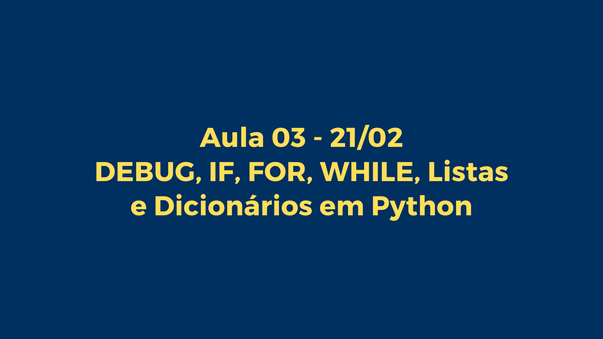
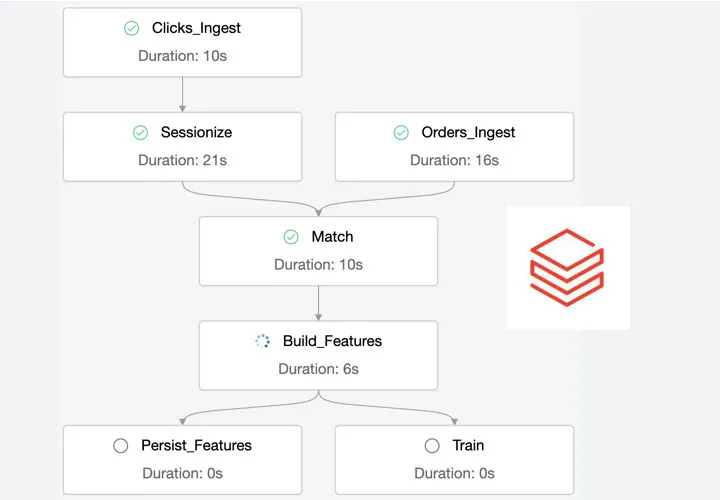
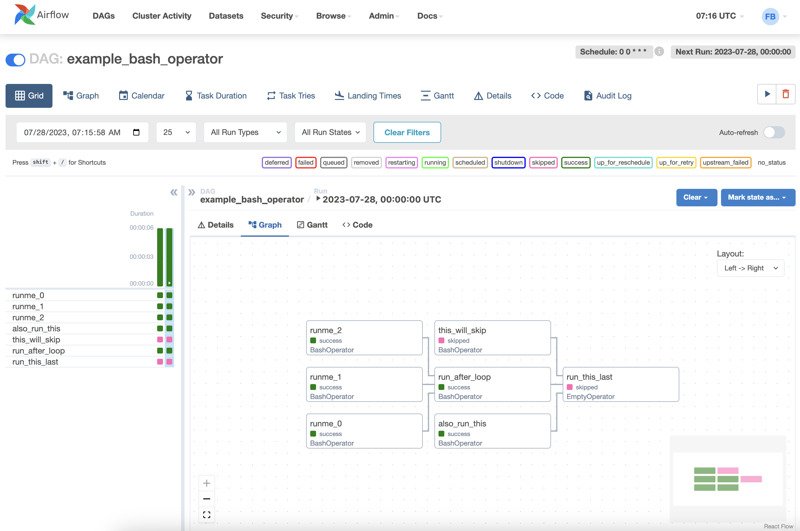
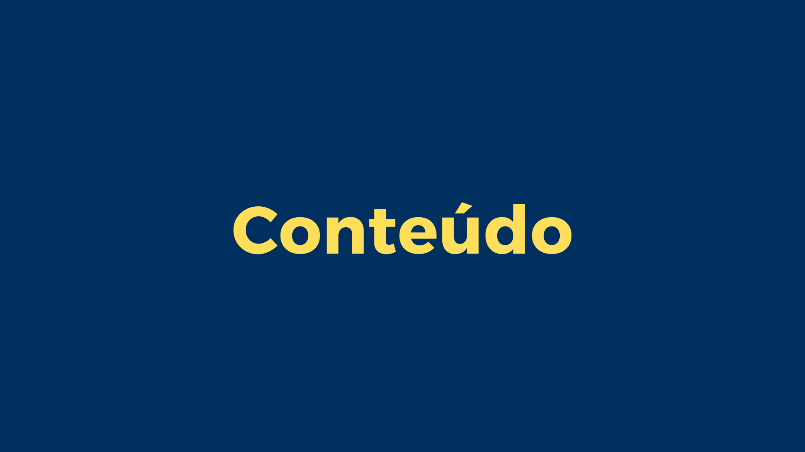
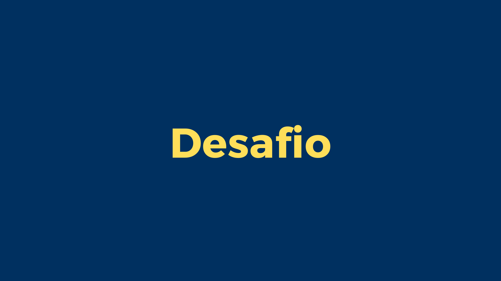
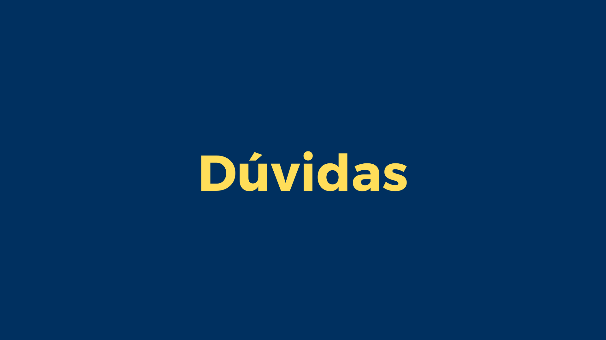

# Aula 03: DEBUG, IF, FOR, While, Listas e Dicionários em Python



Bem-vindo à terceira aula do bootcamp!

Hoje, vamos explorar estruturas de controle de fluxo como if, for, e while. 

Usamos estrutura de Controle de Fluxo para tomar decisões!

Databricks tem workflow


Airflow principal ferramenta de workflow


### Estruturas de Controle de Fluxo

Exploraremos como utilizar `if` para tomar decisões baseadas em condições, `for` para iterar sobre sequências de dados, e `while` para executar blocos de código enquanto uma condição for verdadeira.

Para saber mais:
[Doc](https://docs.python.org/pt-br/3/tutorial/controlflow.html)



## Estruturas de Controle de Fluxo

O if é uma estrutura condicional fundamental em Python que avalia se uma condição é verdadeira (True) e, se for, executa um bloco de código. Se a condição inicial não for verdadeira, você pode usar elif (else if) para verificar condições adicionais, e else para executar um bloco de código quando nenhuma das condições anteriores for verdadeira.

Provavelmente o mais conhecido comando de controle de fluxo é o if. Por exemplo:

```python
x = int(input("Please enter an integer: "))

if x < 0:
    x = 0
    print('Negative changed to zero')
elif x == 0:
    print('Zero')
elif x == 1:
    print('Single')
else:
    print('More')
```

### Exercício 1: Verificação de Qualidade de Dados

Você está analisando um conjunto de dados de vendas e precisa garantir que todos os registros tenham valores positivos para `quantidade` e `preço`. Escreva um programa que verifique esses campos e imprima "Dados válidos" se ambos forem positivos ou "Dados inválidos" caso contrário.

```python
quantidade = 10  # Exemplo de valor, substitua com input do usuário se necessário
preço = 20  # Exemplo de valor, substitua com input do usuário se necessário

if quantidade > 0 and preço > 0:
    print("Dados válidos")
else:
    print("Dados inválidos")
```

### Exercício 2: Classificação de Dados de Sensor

Imagine que você está trabalhando com dados de sensores IoT. Os dados incluem medições de temperatura. Você precisa classificar cada leitura como 'Baixa', 'Normal' ou 'Alta'. Considerando que:

* Temperatura < 18°C é 'Baixa'
* Temperatura >= 18°C e <= 26°C é 'Normal'
* Temperatura > 26°C é 'Alta'

```python
temperatura = 22  # Exemplo de valor, substitua com input do usuário se necessário

if temperatura < 18:
    print("Baixa")
elif 18 <= temperatura <= 26:
    print("Normal")
else:
    numero = int(input("Por favor, digite um número entre 1 e 10: "))

print("Número válido!")
```

#### 13. Consumo de API Simulado

**Objetivo:** Simular o consumo de uma API paginada, onde cada "página" de dados é processada em loop até que não haja mais páginas.

```python
pagina_atual = 1
paginas_totais = 5  # Simulação, na prática, isso viria da API

while pagina_atual <= paginas_totais:
    print(f"Processando página {pagina_atual} de {paginas_totais}")
    # Aqui iria o código para processar os dados da página
    pagina_atual += 1

print("Todas as páginas foram processadas.")
```

#### 14. Tentativas de Conexão

**Objetivo:** Simular tentativas de reconexão a um serviço com um limite máximo de tentativas.

```python
tentativas_maximas = 5
tentativa = 1

while tentativa <= tentativas_maximas:
    print(f"Tentativa {tentativa} de {tentativas_maximas}")
    # Simulação de uma tentativa de conexão
    # Aqui iria o código para tentar conectar
    if True:  # Suponha que a conexão foi bem-sucedida
        print("Conexão bem-sucedida!")
        break
    tentativa += 1
else:
    print("Falha ao conectar após várias tentativas.")
```

#### 15. Processamento de Dados com Condição de Parada

**Objetivo:** Processar itens de uma lista até encontrar um valor específico que indica a parada.

```python
itens = [1, 2, 3, "parar", 4, 5]

i = 0
while i < len(itens):
    if itens[i] == "parar":
        print("Parada encontrada, encerrando o processamento.")
        break
    # Processa o item
    print(f"Processando item: {itens[i]}")
    i += 1
```
## Estruturas de Controle de Fluxo



Integre na solução anterior um fluxo de While que repita o fluxo até que o usuário insira as informações corretas
    
##### Solução
```python
# Inicializa as variáveis para o controle do loop
nome_valido = False
salario_valido = False
bonus_valido = False

# Loop para verificar o nome
while not nome_valido:
    try:
        nome = input("Digite seu nome: ")
        if len(nome) == 0:
            raise ValueError("O nome não pode estar vazio.")
        elif any(char.isdigit() for char in nome):
            raise ValueError("O nome não deve conter números.")
        else:
            print("Nome válido:", nome)
            nome_valido = True
    except ValueError as e:
        print(e)

# Loop para verificar o salário
while not salario_valido:
    try:
        salario = float(input("Digite o valor do seu salário: "))
        if salario < 0:
            print("Por favor, digite um valor positivo para o salário.")
        else:
            salario_valido = True
    except ValueError:
        print("Entrada inválida para o salário. Por favor, digite um número.")

# Loop para verificar o bônus
while not bonus_valido:
    try:
        bonus = float(input("Digite o valor do bônus recebido: "))
        if bonus < 0:
            print("Por favor, digite um valor positivo para o bônus.")
        else:
            bonus_valido = True
    except ValueError:
        print("Entrada inválida para o bônus. Por favor, digite um número.")

bonus_recebido = 1000 + salario * bonus  # Exemplo simples de cálculo de bônus

# Imprime as informações para o usuário
print(f"{nome}, seu salário é R${salario:.2f} e seu bônus final é R${bonus_recebido:.2f}.")
```

