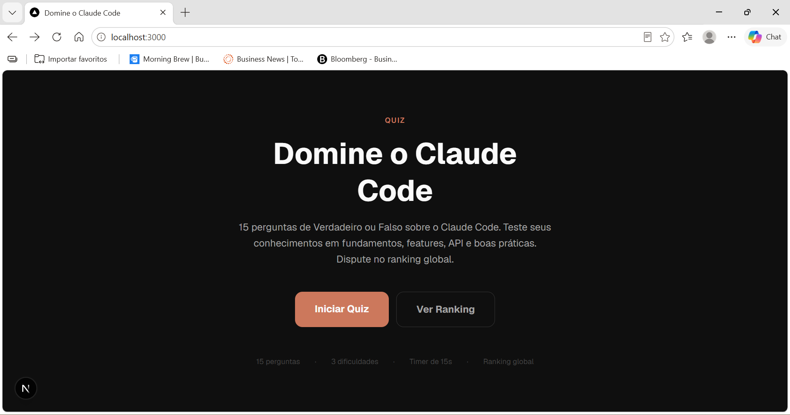

# 🤖 Domine o Claude Code — Quiz

> Quiz de Verdadeiro ou Falso sobre o **Claude Code**, com sistema de pontuação, timer e ranking global.

[](https://nextjs.org)
[](https://www.typescriptlang.org)
[](https://tailwindcss.com)
[](https://supabase.com)
[](https://vercel.com)

---

## 🎮 Acesse o Quiz

**[→ quiz-claude-code.vercel.app](https://quiz-claude-code.vercel.app)**

**[→ quiz-claude-code local](http://localhost:3000/)**

---

## 📸 Preview



---

## 📖 Sobre o Projeto

O **Domine o Claude Code** é uma aplicação web gamificada para testar e fixar conhecimentos sobre o [Claude Code](https://claude.ai/code) — a CLI oficial da Anthropic. São **15 perguntas por partida**, com dificuldade progressiva, timer de 15 segundos, bônus de velocidade e streak, e um leaderboard global.

### Categorias de perguntas

| Categoria | Conteúdo |
|---|---|
| Fundamentos CLI | O que é, instalação, comandos básicos |
| Features e Produtividade | Hooks, slash commands, MCP servers, subagents |
| Claude API/SDK | API Anthropic, Agent SDK, tool use, prompt caching |
| Boas práticas | CLAUDE.md, permissões, workflows, IDEs |

### Sistema de pontuação

```
pontos = 100 + (segundosRestantes × 5) + bonusStreak
bonusStreak = streakAtual ≥ 3 ? (streakAtual - 2) × 25 : 0
```

---

## 🛠️ Stack

- **Framework:** Next.js (App Router) + TypeScript
- **Estilização:** Tailwind CSS — dark mode, acento laranja `#CC785C`
- **Backend:** Supabase (PostgreSQL, RLS habilitado)
- **Deploy:** Vercel

---

## 🚀 Rodando localmente

### Pré-requisitos

- Node.js 18+
- Conta no [Supabase](https://supabase.com) com a tabela `leaderboard` criada

### Setup

```bash
# 1. Clone o repositório
git clone <url-do-repo>
cd 01-quiz-claude-code

# 2. Instale as dependências
npm install

# 3. Configure as variáveis de ambiente
cp .env.example .env.local
# Edite .env.local com suas chaves do Supabase

# 4. Inicie o servidor de desenvolvimento
npm run dev
```

Acesse em [http://localhost:3000](http://localhost:3000).

### Variáveis de ambiente

Crie o arquivo `.env.local` na raiz do projeto:

```env
NEXT_PUBLIC_SUPABASE_URL=sua_url_aqui
NEXT_PUBLIC_SUPABASE_ANON_KEY=sua_chave_anonima_aqui
```

> **Nunca commite o `.env.local`** — ele já está no `.gitignore`.

---

## 🗄️ Banco de dados (Supabase)

Execute o SQL abaixo no editor do Supabase para criar a tabela:

```sql
create table leaderboard (
  id uuid primary key default gen_random_uuid(),
  nickname text not null default 'Anônimo',
  score integer not null,
  correct_count integer not null,
  created_at timestamptz not null default now()
);

create index idx_leaderboard_score on leaderboard (score desc);

alter table leaderboard enable row level security;

create policy "leitura_publica" on leaderboard
  for select using (true);

create policy "insercao_publica" on leaderboard
  for insert with check (true);
```

---

## 📁 Estrutura de pastas

```
app/
  page.tsx              # Home
  quiz/page.tsx         # Partida
  resultado/page.tsx    # Resultado + salvar ranking
  ranking/page.tsx      # Leaderboard
components/
  QuestionCard.tsx
  Timer.tsx
  AnswerFeedback.tsx
  ScoreBoard.tsx
  ProgressBar.tsx
  Leaderboard.tsx
lib/
  supabase.ts
  scoring.ts
  quiz.ts
data/
  questions.json        # 30–50 perguntas (V/F)
types/
  index.ts
```

---

## 📜 Licença

MIT — sinta-se livre para usar, adaptar e compartilhar.
