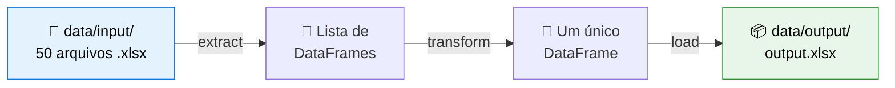

<div align="center">

# Como Estruturar um Projeto de Engenharia de Dados

[](https://suajornadadedados.com.br/)
[](https://python.org)
[](https://python-poetry.org/)
[](https://pandas.pydata.org/)
[](https://docs.pytest.org/)
[](https://www.mkdocs.org/)

</div>

---

## Sobre.

**Objetivo educacional:** Desenvolver um pipeline ETL simples, demonstrando como estruturar um projeto de dados seguindo boas práticas — com ambiente isolado, testes, qualidade do código, documentação e automação.

---

## Índice.

- [Para quem é este projeto](#-para-quem-é-este-projeto)
- [A ideia central: o código é só metade do trabalho](#-a-ideia-central-o-código-é-só-metade-do-trabalho)
- [O que o pipeline faz](#-o-que-o-pipeline-faz)
- [Estrutura de pastas (e por que cada uma existe)](#-estrutura-de-pastas-e-por-que-cada-uma-existe)
- [Parte 1 — Ambiente de desenvolvimento](#-parte-1--ambiente-de-desenvolvimento)
  - [Por que isolar o ambiente?](#por-que-isolar-o-ambiente)
  - [pyenv — controlando a versão do Python](#1-pyenv--controlando-a-versão-do-python)
  - [Poetry — dependências e ambiente virtual](#2-poetry--dependências-e-ambiente-virtual)
  - [Git e GitHub — versionando o código](#3-git-e-github--versionando-o-código)
- [Parte 2 — Código e testes](#-parte-2--código-e-testes)
- [Parte 3 — Qualidade de código](#-parte-3--qualidade-de-código)
- [Parte 4 — Automação](#-parte-4--automação)
- [Como rodar o projeto](#-como-rodar-o-projeto)
- [Glossário rápido](#-glossário-rápido)

---

## Para quem é este projeto.

Este repositório faz parte da formação do **[Jornada de Dados](https://suajornadadedados.com.br/)** realizado por Luciano Vasconcelos.

Ele é para você que:
- já sabe escrever um script em Python, mas **nunca transformou em um projeto de verdade**;
- quer entender o que são `pyenv`, `Poetry`, ambiente virtual, testes e CI — e *por que* eles existem;
- quer um **modelo replicável** para estruturar qualquer projeto de dados no futuro.

> 💡 Leia este README de cima a baixo. Ele é na prática, um passo a passo de como organizar um projeto Python — a "tarefa" do ETL é só o pretexto para aprender a estruturar.

---

## A ideia central: o código é só metade do trabalho.

Quando começamos a programar, achamos que um projeto **é o código**. Mas um projeto profissional é o código **mais tudo que o envolve**:

| Sem estrutura ❌ | Com estrutura ✅ |
|------------------|------------------|
| Um arquivo `script.py` solto na pasta | Código separado por responsabilidade |
| "Na minha máquina funciona" | Ambiente reproduzível em qualquer máquina |
| Medo de mudar o código e quebrar tudo | Testes que avisam quando algo quebra |
| Cada um formata do seu jeito | Padrão automático para todo mundo |
| "Como eu rodo isso mesmo?" | README e automação que explicam sozinhos |

A tarefa deste projeto é simples de propósito: **ler vários arquivos Excel, juntá-los em um só e salvar o resultado**. O valor está em fazer isso *do jeito profissional* estruturado.

---

## O que o pipeline faz.

Este projeto implementa um **ETL** — sigla para **E**xtract, **T**ransform, **L**oad (Extrair, Transformar, Carregar):

- **Extract (Extrair):** buscar os dados na origem.
- **Transform (Transformar):** limpar, juntar, ajustar os dados.
- **Load (Carregar):** salvar o resultado no destino.



| Etapa | Arquivo | Função | O que faz |
|-------|---------|--------|-----------|
| **Extract** | `app/pipeline/extract.py` | `extract_from_excel(path)` | Lê todos os `.xlsx` de uma pasta e devolve uma **lista de DataFrames** |
| **Transform** | `app/pipeline/transform.py` | `contact_data_frames(lista)` | Concatena a lista em **um único DataFrame** (`pd.concat`) |
| **Load** | `app/pipeline/load.py` | `load_excel(df, path, nome)` | Salva o DataFrame consolidado como `.xlsx` (cria a pasta se não existir) |

A orquestração das três etapas — a "receita" que chama uma função depois da outra — está em [`app/main.py`](app/main.py).

> 📌 **DataFrame** é a estrutura de dados do pandas: pense numa "planilha em memória", com linhas e colunas, que o Python consegue manipular.

---

## Estrutura de pastas (e por que cada uma existe).

```
02-workshop-estrutura/
├── app/                        #    O código da aplicação
│   ├── main.py                 #    Orquestra extract → transform → load
│   └── pipeline/               #    Cada etapa do ETL em seu próprio módulo
│       ├── __init__.py         #    Marca a pasta como um "pacote" Python
│       ├── extract.py          #    E — leitura dos arquivos
│       ├── transform.py        #    T — consolidação
│       └── load.py             #    L — escrita do resultado
├── data/                       #    Os dados (entram e saem aqui)
│   ├── input/                  #    Arquivos .xlsx de entrada
│   └── output/                 #    Resultado consolidado (output.xlsx)
├── tests/                      #    Os testes automatizados
│   └── test_pipeline.py
├── docs/                       #    A documentação (MkDocs)
│   └── index.md
├── .github/workflows/ci.yml    #    CI: roda os testes a cada Pull Request
├── .pre-commit-config.yaml     #    Checks de qualidade antes de cada commit
├── .python-version             #    Fixa a versão do Python (pyenv)
├── .gitignore                  #    Diz ao Git o que NÃO enviar para o GitHub
├── mkdocs.yml                  #    Configuração da documentação
├── pyproject.toml              #    Dependências, configs e tasks (Poetry)
├── poetry.lock                 #    Versões exatas travadas (build reproduzível)
└── README.md                   #    Este arquivo
```

**Por que separar assim?** Manter código (`app/`), dados (`data/`), testes (`tests/`) e documentação (`docs/`) em pastas distintas é uma convenção universal. Qualquer pessoa que chega ao projeto sabe **onde procurar cada coisa** sem precisar perguntar.

**O arquivo `.gitignore`**, na raiz do projeto, é a "lista do que não entra no repositório". Ele diz ao Git quais arquivos e pastas **ignorar** na hora de enviar o código para o GitHub. Isso é essencial, pois mantém o repositório **leve, seguro e limpo**, contendo apenas o que realmente importa, o código-fonte e os arquivos de configuração.

---

## 🟦 Parte 1 — Ambiente de desenvolvimento.

Antes de escrever qualquer linha de lógica, preparamos o "terreno". Esta é a parte que mais gera o famoso *"na minha máquina funciona"* — e que vamos eliminar.

### Por que isolar o ambiente?

Imagine que você tem dois projetos:
- O **Projeto A** precisa do `pandas` versão 1.5.
- O **Projeto B** precisa do `pandas` versão 2.2.

Se você instalar tudo "no Python do computador", um projeto vai quebrar o outro. A solução é dar a **cada projeto seu próprio ambiente isolado**, com suas próprias versões de Python e de bibliotecas. É isso que `pyenv` e `Poetry` resolvem.

> 🧰 **Analogia:** o computador é a sua cozinha. Cada projeto é uma receita. Você não quer misturar os ingredientes de um bolo com os de uma feijoada. Cada projeto ganha sua própria bancada (ambiente) com seus próprios ingredientes (bibliotecas).

### 1. pyenv — controlando a versão do Python.

**O problema:** o Python instalado no seu sistema pode ser a versão 3.10, mas este projeto foi feito para a **3.11.3**. Versões diferentes podem se comportar de formas diferentes.

**A solução:** o `pyenv` permite instalar **várias versões do Python** lado a lado e escolher qual usar em cada projeto.

Neste repositório existe um arquivo [`.python-version`](.python-version) com o conteúdo `3.11.3`. Quando você entra na pasta, o `pyenv` lê esse arquivo e ativa automaticamente a versão certa.

```bash
pyenv install 3.11.3   # instala a versão (só precisa fazer uma vez)
pyenv local 3.11.3     # cria/define o .python-version para esta pasta
python --version       # deve mostrar Python 3.11.3
```

> 🪟 **No Windows** o `pyenv` original não funciona — use o [**pyenv-win**](https://github.com/pyenv-win/pyenv-win), que tem a mesma ideia com instalação própria.

### 2. Poetry — dependências e ambiente virtual.

O `Poetry` faz **duas coisas** ao mesmo tempo:

**a) Cria o ambiente virtual (`.venv`)** — uma "caixinha" isolada onde as bibliotecas deste projeto ficam guardadas, sem afetar o resto do computador.

**b) Gerencia as dependências** — controla *quais* bibliotecas o projeto usa e em *quais versões*, registrando tudo em dois arquivos:
- [`pyproject.toml`](pyproject.toml) → a **lista** de dependências que você pediu (legível por humanos).
- `poetry.lock` → as **versões exatas** que foram instaladas (garante que todo mundo instale exatamente o mesmo, o tal "build reproduzível").

```bash
# Faz o Poetry criar o .venv DENTRO da pasta do projeto (recomendado)
poetry config virtualenvs.in-project true

# Lê o pyproject.toml e instala todas as dependências no .venv
poetry install

# Ativa o ambiente virtual (entra na "caixinha")
poetry shell
```

Depois do `poetry install`, surge a pasta `.venv/` com tudo isolado lá dentro. Para **adicionar** uma nova biblioteca ao projeto:

```bash
poetry add pandas      # instala e registra no pyproject.toml automaticamente
poetry add isort       # exemplo: ferramenta de organização de imports
```

> 🧰 **Analogia:** o `pyproject.toml` é a sua **lista de compras**. O `poetry.lock` é a **nota fiscal** com as marcas e quantidades exatas. O `.venv` é a **despensa** onde os ingredientes ficam guardados.

### 3. Git e GitHub — versionando o código.

- **Git** é o sistema de **controle de versão**: ele guarda o histórico de todas as mudanças do seu código. Você pode voltar no tempo, ver o que mudou, quando, e trabalhar sem medo de perder nada.
- **GitHub** é o site onde você **hospeda** esse histórico na nuvem, para fazer backup, colaborar e mostrar seu trabalho.

```bash
git init                 # cria o repositório (a pasta .git) — protege o histórico
git add .                # seleciona os arquivos para o próximo "ponto de salvamento"
git commit -m "feat: estrutura inicial do projeto"   # salva o ponto
git push                 # envia para o GitHub
```

**O arquivo `.gitignore`** fica na raiz e diz ao Git **o que NÃO enviar** para o GitHub. Por exemplo: a pasta `.venv/` (pesada e recriável), arquivos temporários e segredos. Sem ele, você acabaria subindo lixo e até senhas para a internet.

> 🧰 **Analogia:** o Git é uma **máquina do tempo** com fotos (commits) de cada momento do projeto. O GitHub é o **álbum compartilhado na nuvem**. O `.gitignore` é a lista do que **não** entra no álbum.

---

## 🟩 Parte 2 — Código e testes.

Com o ambiente pronto, escrevemos o código **separado por responsabilidade**: cada etapa do ETL em seu próprio arquivo (`extract.py`, `transform.py`, `load.py`). Isso é chamado de **modularização** — em vez de um arquivo gigante, vários arquivos pequenos e fáceis de entender e testar.

### Docstrings — documentação que vive no código.

Cada função tem um bloco `""" ... """` logo abaixo da sua declaração, chamado **docstring**. Ele descreve o que a função faz, seus argumentos e o retorno:

```python
def extract_from_excel(path: str) -> List[pd.DataFrame]:
    """
    Lê os arquivos .xlsx de uma pasta e retorna uma lista de DataFrames.

    args: path (str): caminho da pasta com os arquivos
    return: lista de DataFrames
    """
```

A vantagem: ao passar o mouse sobre a função no editor, **essa descrição aparece sozinha**. É documentação que ajuda o time inteiro e nunca fica "perdida" longe do código.

### Testes com pytest.

**Por que testar?** Para mudar o código com confiança. Se um teste passava e parou de passar, você quebrou algo — e descobre na hora, não em produção.

Os testes ficam em [`tests/test_pipeline.py`](tests/test_pipeline.py) e seguem o padrão **Arrange–Act–Assert** (Preparar – Agir – Verificar):

```python
def testar_a_concatenacao_da_lista_de_dataframe():
    # Arrange — prepara os dados de entrada
    data_frame_list = [df_1, df_2]
    esperado = pd.concat(data_frame_list, ignore_index=True)

    # Act — executa a função que está sendo testada
    resultado = contact_data_frames(data_frame_list)

    # Assert — verifica se o resultado é o esperado
    assert resultado.shape == (4, 2)
    assert esperado.equals(resultado)
```

Rode com `task test` ou `poetry run pytest -v`.

> 💡 **Dica de organização:** é comum criar uma **branch** no Git para cada etapa (`extract`, `transform`, `load`). Assim você desenvolve e testa cada parte isoladamente antes de juntar tudo na branch principal.

---

## 🟨 Parte 3 — Qualidade de código.

Aqui garantimos que o código siga um **padrão único**, independente de quem escreveu. A referência é a **[PEP 8](https://peps.python.org/pep-0008/)** — o guia oficial de estilo do Python.

### Formatação automática.

Em vez de formatar "no olho", deixamos as ferramentas realizarem:

| Ferramenta | O que faz |
|------------|-----------|
| **isort** | Ordena e agrupa os `import` em uma ordem padronizada |
| **blue** | Formata o código (variação do `black` que aceita aspas simples) |
| **pydocstyle** | Verifica se módulos e funções têm docstrings (PEP 257) |

```bash
task format    # roda isort + blue de uma vez (definido no pyproject.toml)
```

### Análise estática (linters).

**Linters** são ferramentas que "leem" seu código **sem executá-lo**, procurando problemas: erros de sintaxe, nomes ruins, código inseguro, imports não usados. É como um corretor ortográfico para programação. Exemplos comuns no ecossistema Python: `flake8`, `pylint`, `mypy` (checa tipos) e `pip-audit` (verifica se alguma biblioteca tem vulnerabilidade de segurança conhecida).

> 🧰 **Analogia:** o linter é o **revisor de texto** que lê o seu trabalho antes de publicar e aponta erros que você não viu.

---

## 🟪 Parte 4 — Automação.

A automação garante que as boas práticas aconteçam **sozinhas**, sem depender da memória de ninguém.

### pre-commit — qualidade antes de salvar no histórico.

O arquivo [`.pre-commit-config.yaml`](.pre-commit-config.yaml) define *hooks*: verificações que rodam **automaticamente a cada `git commit`**. Se algo estiver fora do padrão (espaços sobrando, código mal formatado, falta de docstring, biblioteca vulnerável), **o commit é bloqueado até você corrigir**.

```bash
pre-commit install            # instala os hooks no repositório (uma vez)
pre-commit run --all-files    # roda manualmente em todos os arquivos
```

### GitHub Actions — testes automáticos na nuvem (CI).

**CI** significa *Continuous Integration* (Integração Contínua). A ideia: toda vez que alguém propõe uma mudança (um **Pull Request**), um servidor do GitHub **roda os testes automaticamente**. Se algum teste falhar, a mudança não é aprovada.

A configuração está em [`.github/workflows/ci.yml`](.github/workflows/ci.yml). Ela instala o Python, instala o Poetry, instala as dependências e roda o `pytest` — tudo sem intervenção humana.

> 🧰 **Analogia:** o CI é um **inspetor de qualidade** na esteira da fábrica: nada com defeito passa para a próxima etapa.

---

## Como rodar o projeto.

### Pré-requisitos.
- [Python 3.11.3](https://www.python.org/) (via [pyenv](https://github.com/pyenv/pyenv) ou [pyenv-win](https://github.com/pyenv-win/pyenv-win))
- [Poetry](https://python-poetry.org/docs/#installation)
- [Git](https://git-scm.com/)

### Passo a passo.

```bash
# 1. Clone e entre na pasta do projeto
git clone https://github.com/Suami-Yonashiro/formacao-jornada-de-dados.git
cd formacao-jornada-de-dados/01-projetos/02-workshop-estrutura

# 2. Garanta a versão correta do Python
pyenv install 3.11.3   # se ainda não tiver
pyenv local 3.11.3

# 3. Crie o ambiente virtual e instale as dependências
poetry config virtualenvs.in-project true
poetry install

# 4. Ative o ambiente
poetry shell
```

### Comandos do dia a dia (via taskipy).

```bash
task run       # Executa o pipeline ETL (app/main.py)
task test      # Roda os testes com pytest -v
task format    # Padroniza o código (isort + blue)
```

> 🪟 **Windows:** as tasks `run`/`kill` do `pyproject.toml` usam comandos Unix (`python3`, `lsof`).
> No Windows, rode o pipeline com: `poetry run python app/main.py`

### Documentação local (MkDocs).

```bash
poetry run mkdocs serve      # http://127.0.0.1:8000  (rascunho vivo, recarrega sozinho)
poetry run mkdocs build      # gera o site final na pasta /site
```

> A diferença: `mkdocs serve` é para **testar no seu computador**; `mkdocs build` gera a versão **final** pronta para publicar na internet.

---

## Glossário rápido.

| Termo | Significado |
|-------|-------------|
| **ETL** | Extract, Transform, Load — extrair, transformar e carregar dados |
| **Ambiente virtual (`.venv`)** | "Caixinha" isolada com as bibliotecas de um projeto específico |
| **Dependência** | Biblioteca externa que o projeto precisa para funcionar (ex.: pandas) |
| **pyenv** | Ferramenta para instalar e alternar entre versões do Python |
| **Poetry** | Ferramenta que cria o ambiente virtual e gerencia as dependências |
| **Git** | Sistema de controle de versão (histórico do código) |
| **GitHub** | Site que hospeda repositórios Git na nuvem |
| **Commit** | Um "ponto de salvamento" no histórico do Git |
| **Branch** | Uma "linha do tempo" paralela para desenvolver sem afetar o código principal |
| **Pull Request (PR)** | Proposta de juntar as mudanças de uma branch na principal |
| **DataFrame** | Estrutura do pandas parecida com uma planilha (linhas e colunas) |
| **Docstring** | Texto de documentação dentro de uma função (`""" ... """`) |
| **Linter** | Ferramenta que analisa o código sem executá-lo, procurando erros |
| **CI** | Continuous Integration — testes automáticos a cada mudança |
| **Hook** | Verificação disparada automaticamente em um momento (ex.: no commit) |

---

## Autor.

Projeto da Formação em Engenharia de Dados da [Jornada de Dados](https://suajornadadedados.com.br/), executado como aluno por **Suami Yuji Yonashiro**.

Licença: [MIT](https://opensource.org/licenses/MIT).