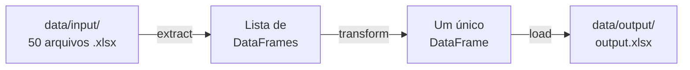

# Workshop: Estrutura de Projeto de Engenharia de Dados

Documentação do projeto **02-workshop-estrutura** — um pipeline ETL simples, usado
para demonstrar como estruturar um projeto de dados profissional: ambiente isolado,
testes, qualidade de código, documentação e automação.

!!! tip "Objetivo"
    Mais do que resolver a tarefa (consolidar vários arquivos Excel em um só), o foco
    é mostrar **a fundação** que transforma um script solto em um projeto de verdade.

---

## Visão geral do pipeline

O projeto implementa um **ETL** — *Extract, Transform, Load*:

| Etapa | Módulo | Função | Responsabilidade |
|-------|--------|--------|------------------|
| **Extract** | `pipeline.extract` | `extract_from_excel` | Lê os `.xlsx` de uma pasta e devolve uma lista de DataFrames |
| **Transform** | `pipeline.transform` | `contact_data_frames` | Concatena a lista em um único DataFrame |
| **Load** | `pipeline.load` | `load_excel` | Salva o DataFrame consolidado em um arquivo Excel |



---

## Como executar

```bash
poetry install                  # instala as dependências no .venv
poetry run python app/main.py   # roda o pipeline completo
poetry run pytest -v            # roda os testes
```

---

## Referência da API

A documentação abaixo é gerada **automaticamente a partir das docstrings** do código.
Toda vez que uma função é documentada no código, ela aparece aqui — sem trabalho manual.

### Extract

::: pipeline.extract
    options:
      show_root_heading: true
      show_source: true
      heading_level: 4

### Transform

::: pipeline.transform
    options:
      show_root_heading: true
      show_source: true
      heading_level: 4

### Load

::: pipeline.load
    options:
      show_root_heading: true
      show_source: true
      heading_level: 4
