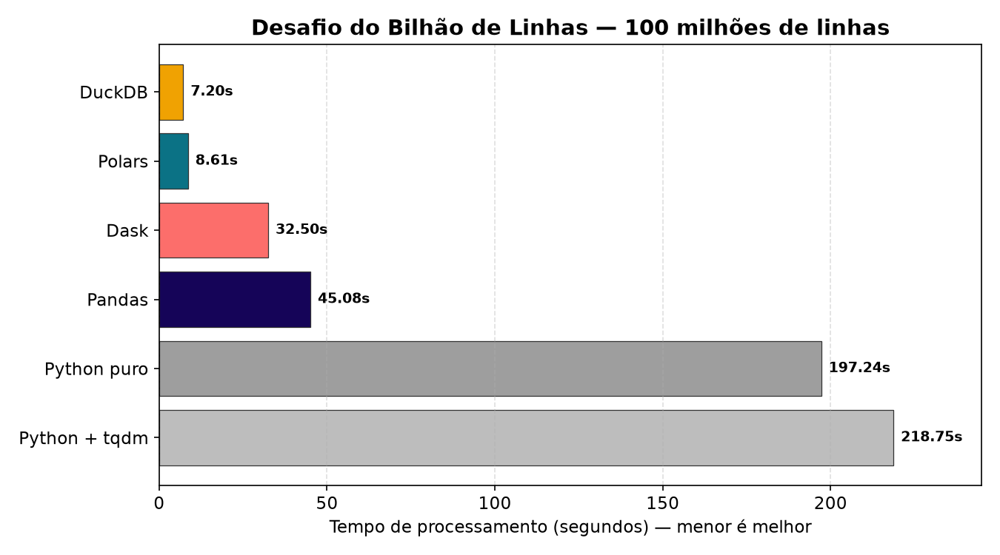
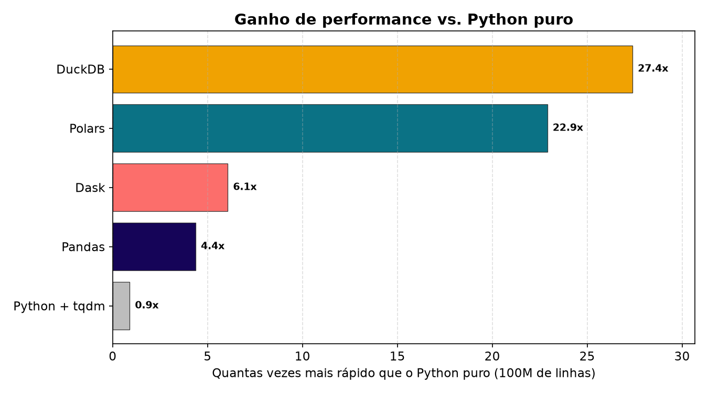
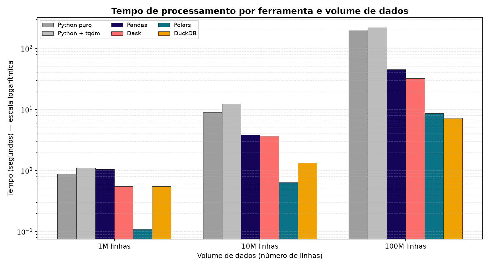
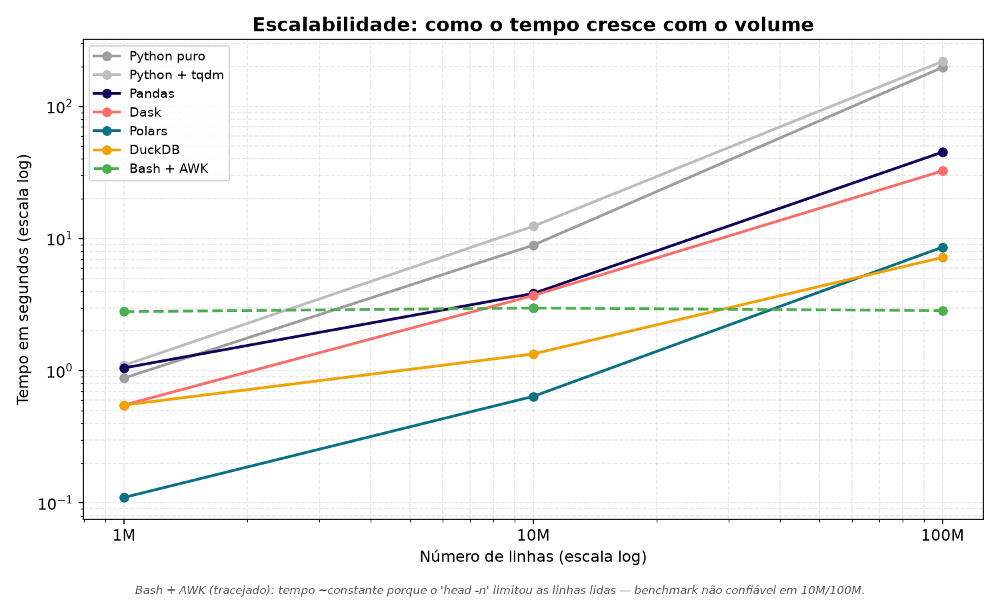

# Desafio do Bilhão de Linhas — Comparando Ferramentas de Processamento de Dados em Python

> Adaptação didática do [The One Billion Row Challenge (1BRC)](https://github.com/gunnarmorling/1brc) para Python, feita como exercício da **Jornada de Dados** (Módulo *Python Avançado para Dados — Aula 05*).
>
> ⚠️ **Importante:** este repositório **não** processa o arquivo de 1 bilhão de linhas original (~14 GB). Aqui os testes foram feitos com **1 milhão**, **10 milhões** e **100 milhões** de linhas, justamente para tornar o experimento reproduzível em um notebook comum e enxergar **como cada ferramenta escala** conforme o volume de dados cresce.

---

## 1. O que é este exercício?

O desafio é simples de enunciar e difícil de otimizar:

> Dado um arquivo de texto com milhões/bilhões de medições de temperatura de estações meteorológicas, calcule a temperatura **mínima**, **média** e **máxima** de cada estação e exiba o resultado **ordenado pelo nome da estação**.

Cada linha do arquivo (`data/measurements.txt`) tem o formato:

```
<nome da estação>;<temperatura>
```

Exemplo:

```
Hamburg;12.0
Bulawayo;8.9
Palembang;38.8
St. Johns;15.2
Cracow;12.6
Istanbul;6.2
```

A saída esperada é uma tabela como esta (resumida):

| station     | min  | mean | max  |
|-------------|------|------|------|
| Abha        | -31.1| 18.0 | 66.5 |
| Abidjan     | -25.9| 26.0 | 74.6 |
| Accra       | -24.8| 26.4 | 76.3 |
| ...         | ...  | ...  | ...  |
| Zürich      | -42.0| 9.3  | 63.6 |

Parece trivial — é só um `GROUP BY` com `MIN`, `AVG` e `MAX`. O que torna o exercício interessante é a **escala**: agregação e ordenação são operações pesadas, e a forma como cada ferramenta lê o arquivo, usa a memória RAM e distribui o trabalho entre os núcleos da CPU faz uma diferença gigantesca no tempo final.

---

## 2. Objetivos de aprendizado

Este projeto serve para enxergar, na prática:

1. **Por que "a ferramenta certa" importa** — o mesmo cálculo pode levar de **7 segundos a mais de 3 minutos** dependendo da biblioteca escolhida.
2. **A diferença entre processamento *eager* e *lazy* (streaming)** — ler tudo de uma vez vs. processar em "esteira", em blocos.
3. **O conceito de processamento em lotes (*chunks*)** e paralelismo (usar todos os núcleos da CPU).
4. **Como o volume de dados muda o jogo** — uma ferramenta que é boa com 1 milhão de linhas pode ser péssima com 100 milhões (e vice-versa).
5. **Que Python "puro" é educativo, mas não é a melhor opção** para Big Data — o ecossistema (Polars, DuckDB) é quem entrega performance.

---

## 3. As ferramentas comparadas

Cada arquivo na pasta `src/` resolve **o mesmo problema** com uma abordagem diferente. No final de cada arquivo há um comentário com os tempos medidos.

| Arquivo | Ferramenta | Estratégia central |
|---|---|---|
| `using_python_old.py` | **Python puro** | Lê linha a linha com `csv.reader`, acumula estatísticas (`min`/`max`/`soma`/`qtd`) em um dicionário. Streaming manual, baixíssimo uso de RAM. |
| `using_python.py` | **Python puro + tqdm** | Igual ao anterior, mas com barra de progresso (`tqdm`). A barra adiciona uma pequena sobrecarga por iteração. |
| `using_pandas.py` | **Pandas** | Lê o arquivo em *chunks* e usa `multiprocessing.Pool` para processar cada bloco em um núcleo diferente. Agregação em duas fases (parcial por chunk → final global). |
| `using_dask.py` | **Dask** | DataFrame "lazy" e particionado. Constrói um grafo de tarefas e só executa no `.compute()`, paralelizando automaticamente. |
| `using_polars.py` | **Polars** | Motor em **Rust** com execução *lazy* e *streaming* (`scan_csv` + `collect(engine="streaming")`). |
| `using_duckdb.py` | **DuckDB** | Banco analítico (OLAP) embarcado. Resolve tudo com uma única query **SQL** lendo o CSV direto do disco. |
| `using_bash_and_awk.sh` | **Bash + AWK** | Pipeline Unix puro, sem Python. Processa em streaming via `awk` e ordena com `sort`. |

---

## 4. Resultados

> 🖥️ **Ambiente de teste:** este experimento foi executado em ambiente **Windows**. Os scripts originais foram adaptados (encoding UTF-8, caminhos, remoção do `pv` no Bash etc.) para rodar nativamente no Windows. Os tempos abaixo são os medidos **neste setup** — eles servem para comparar as ferramentas *entre si*, não como benchmark absoluto de hardware.

### Tabela comparativa (tempo em segundos)

| Ferramenta | 1 milhão | 10 milhões | 100 milhões |
|---|---:|---:|---:|
| Python puro (`using_python_old.py`) | 0.88 | 8.91 | 197.24 |
| Python + tqdm (`using_python.py`) | 1.10 | 12.39 | 218.75 |
| Pandas paralelo (`using_pandas.py`) | 1.05 | 3.84 | 45.08 |
| Dask (`using_dask.py`) | 0.55 | 3.71 | 32.50 |
| Polars (`using_polars.py`) | **0.11** | **0.64** | 8.61 |
| DuckDB (`using_duckdb.py`) | 0.55 | 1.34 | **7.20** |
| Bash + AWK (`using_bash_and_awk.sh`) | 2.80 | 2.98 | 2.85 ⚠️ |

> 📁 **Nota sobre os dados:** o `measurements.txt` versionado/atual contém **1 milhão de linhas** (~16,9 MB). Os arquivos de 10M e 100M foram **apagados após os testes** para economizar espaço em disco — por isso os tempos acima foram registrados nos comentários `# Resultados:` no final de cada script em `src/`. Para reproduzir 10M/100M, basta regenerar o arquivo (ver a seção [Como executar](#8-como-executar)).

### A comparação "manchete" — 100 milhões de linhas

Quanto menor a barra, mais rápido. DuckDB e Polars deixam o resto para trás:



### Quanto cada ferramenta acelera vs. Python puro

Tomando o Python puro como linha de base (1x), o ganho em 100M de linhas:



### Todas as ferramentas, nos três volumes (escala logarítmica)

A escala log é necessária porque os tempos variam de centésimos de segundo a mais de 3 minutos:



### Escalabilidade — como o tempo cresce com o volume

Quanto mais "plana" a linha, melhor a ferramenta escala:



> Os gráficos são gerados pelo script [`src/gerar_graficos.py`](src/gerar_graficos.py) e salvos em `assets/`. Basta editar o dicionário `RESULTADOS` no topo do script e rodá-lo novamente para atualizar tudo.

---

## 5. Análise: o que os números contam

### 🥇 DuckDB e Polars dominam
Em larga escala (100 milhões de linhas), **DuckDB (7.20s)** e **Polars (8.61s)** deixam todos os outros para trás. São cerca de **27 a 30 vezes mais rápidos** que o Python puro. O motivo:
- Ambos são escritos em linguagens compiladas (C++ e Rust) e processam os dados em formato **colunar**, vetorizado.
- Ambos usam **streaming**: não carregam o arquivo inteiro na RAM, processam em blocos contínuos.
- O DuckDB é um banco **OLAP** — ele foi *feito* para `GROUP BY` + agregação. Por isso vence por pouco no maior volume.

### 🥈 Polars é imbatível em volumes menores
Repare que com **1 milhão** e **10 milhões** de linhas, o **Polars** é o mais rápido de todos (0.11s e 0.64s). Ele tem o menor "custo de inicialização". O DuckDB tem um pequeno overhead fixo (engatar o motor SQL), que só compensa quando o volume fica realmente grande.

### 🥉 Pandas e Dask: o meio-termo
- **Pandas** sozinho não escalaria bem, mas aqui foi turbinado com **leitura em chunks + multiprocessing**. Isso o levou de "lento" para razoável (45s em 100M).
- **Dask** faz isso de forma mais automática (grafo lazy + paralelismo) e ficou um pouco à frente do Pandas (32.5s).
- Ambos são boas opções quando você **já tem código em Pandas** e quer escalar sem reescrever tudo.

### 🐌 Python puro: ótimo para aprender, ruim para produção
As versões em Python puro são as mais **didáticas** — você vê exatamente o algoritmo: ler linha, comparar min/max, somar, contar. Mas o loop roda no interpretador Python, linha por linha, sem vetorização. Resultado: **mais de 3 minutos** para 100M de linhas.

E note o detalhe: a versão **com `tqdm`** (barra de progresso) é **mais lenta** que a sem (218s vs 197s). A barra de progresso é atualizada a cada iteração, e em loops de centenas de milhões de iterações esse custo se acumula. **Lição:** instrumentação de progresso tem custo — útil para feedback, mas não "de graça".

### ⚠️ Bash + AWK: por que os tempos ficaram "congelados"?
Os tempos do Bash/AWK (2.80s, 2.98s, 2.85s) ficaram **praticamente iguais** nos três volumes — o que é fisicamente impossível se 100x mais dados estivessem realmente sendo lidos. A explicação está no script:

```bash
head -n $QTD data/measurements.txt | awk -F ";" ...
```

O `head -n $QTD` só lê as primeiras `$QTD` linhas do arquivo. Se o `measurements.txt` presente no disco na hora do teste tinha **menos linhas** do que o `$QTD` pedido (ex.: pedir 100 milhões de um arquivo que só tinha ~1 milhão de linhas geradas), o `head` simplesmente lê o arquivo inteiro e para. Ou seja: os três testes de Bash provavelmente processaram **o mesmo arquivo pequeno**, por isso o tempo não mudou.

👉 **Lição didática:** sempre confira se o dado de entrada realmente tem o tamanho que você acha que tem. Um benchmark só é válido se a entrada for a esperada. Para um teste honesto de Bash/AWK em 100M, é preciso **regenerar** o `measurements.txt` com 100 milhões de linhas antes de rodar o script.

---

## 6. Conclusão

| Se você... | Use |
|---|---|
| Está **aprendendo** o algoritmo / quer entender o que acontece | Python puro |
| Já tem **código legado em Pandas** e quer escalar | Pandas em chunks ou Dask |
| Quer **a maior performance** com uma API moderna de DataFrame | **Polars** |
| Pensa em **SQL** e quer agregar arquivos enormes do disco | **DuckDB** |

A grande lição do desafio: **Python é uma escolha poderosa para Big Data — desde que você use as bibliotecas certas.** O mesmo problema, resolvido em SQL no DuckDB ou em Polars, roda dezenas de vezes mais rápido que um loop "feito na mão", com **menos código** e melhor uso da memória.

Não existe "ferramenta melhor" no absoluto: existe a ferramenta certa para o **volume de dados**, o **contexto da equipe** e a **forma de pensar** (DataFrame vs. SQL) do projeto.

---

## 7. Estrutura do projeto

```
aula-05/
├── data/
│   ├── measurements.txt        # Arquivo gerado com as medições (entrada) — atualmente 1M linhas
│   └── weather_stations.csv    # Lista de estações usada para gerar os dados
├── src/
│   ├── create_measurements.py  # Gera o measurements.txt com N linhas
│   ├── using_python_old.py     # Python puro
│   ├── using_python.py         # Python puro + tqdm
│   ├── using_pandas.py         # Pandas + multiprocessing
│   ├── using_dask.py           # Dask (lazy + paralelo)
│   ├── using_polars.py         # Polars (Rust, streaming)
│   ├── using_duckdb.py         # DuckDB (SQL/OLAP)
│   ├── using_bash_and_awk.sh   # Bash + AWK
│   └── gerar_graficos.py       # Gera os PNGs de comparação (matplotlib)
├── assets/                     # Gráficos PNG usados neste README
│   ├── comparativo_100M.png
│   ├── comparativo_agrupado.png
│   ├── escalabilidade.png
│   └── speedup_vs_python.png
├── pyproject.toml              # Dependências (Poetry)
└── README.md
```

---

## 8. Como executar

### Pré-requisitos
- Python `3.12.1` (recomendado gerenciar com `pyenv`)
- [Poetry](https://python-poetry.org/) para as dependências

Principais bibliotecas (ver `pyproject.toml`):
- Polars `0.20.3`
- DuckDB `0.10.0`
- Dask `^2024.2.0` (extras `complete`)
- tqdm `^4.66.2`
- matplotlib (apenas para gerar os gráficos com `src/gerar_graficos.py`)

### Passo a passo

```bash
# 1. Defina a versão do Python (Windows pode diferir de macOS/Linux)
pyenv local 3.12.1

# 2. Crie o ambiente e instale as dependências
poetry env use 3.12.1
poetry install        # ou: poetry lock && poetry install

# 3. Gere o arquivo de medições com o tamanho desejado
#    (use underscores para legibilidade)
python src/create_measurements.py 1_000_000      # 1 milhão
python src/create_measurements.py 10_000_000     # 10 milhões
python src/create_measurements.py 100_000_000    # 100 milhões  (vá tomar um café ☕)

# 4. Rode a implementação que quiser comparar
python src/using_python_old.py
python src/using_python.py
python src/using_pandas.py
python src/using_dask.py
python src/using_polars.py
python src/using_duckdb.py
```

> 💡 **Dica:** para uma comparação justa, **regenere o `measurements.txt`** no tamanho desejado antes de cada rodada e rode todas as ferramentas sobre o **mesmo** arquivo.

### Rodando o Bash + AWK

O script Bash roda nativamente em ambientes Unix-like (Linux/macOS) e, no Windows, via **Git Bash** ou **WSL**.

```bash
# Dê permissão de execução (Linux/macOS)
chmod +x src/using_bash_and_awk.sh

# Execute, opcionalmente passando a quantidade de linhas a processar
./src/using_bash_and_awk.sh 1000000
```

O argumento define quantas linhas serão lidas com `head`. **Lembre-se:** ele nunca processa mais linhas do que o arquivo realmente tem (ver a seção ⚠️ na análise).

---

## 9. Próximos passos / desafios extras

- 🔁 **Regenerar o `measurements.txt` com 100M de linhas** e rodar o Bash/AWK de verdade, para corrigir o benchmark "congelado".
- 📈 Tentar o **1 bilhão de linhas** original (~14 GB) e ver quais ferramentas sobrevivem.
- 🧪 Medir também o **pico de uso de RAM** de cada abordagem, não só o tempo — é onde streaming (Polars/DuckDB) brilha de verdade.
- ⚙️ Testar o **DuckDB com mais threads** e o **Polars eager vs lazy** para entender o overhead de cada modo.

---

*Projeto desenvolvido como parte da **Jornada de Dados** — formação em Engenharia de Dados.*
*Desafio original: [The One Billion Row Challenge](https://github.com/gunnarmorling/1brc), por Gunnar Morling.*
