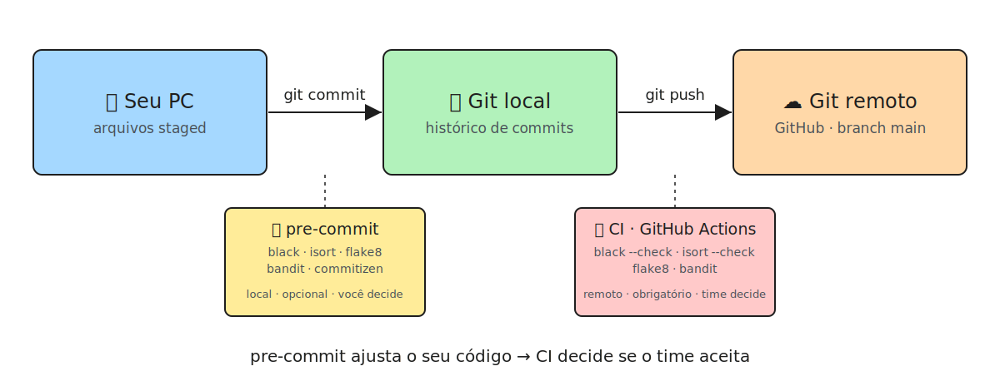

# Aula 06: Revisão, boas práticas, pre-commit (estilo, padrão de código) e CI

Esta aula reúne dois temas que parecem separados mas resolvem o mesmo problema em escalas diferentes: **como garantir que o código que você escreve siga as boas práticas do projeto antes mesmo de sair da sua máquina.**.

- `main.py`: reescrita do processamento de temperaturas (aula 05) usando agregação em streaming (`defaultdict` acumulando min/max/soma/qtd por estação), trocando "guardar tudo em memória" por "guardar só o resumo".
- `main_2.py`: exercício de estruturas de controle de fluxo (`while` + `try/except`) para validação de entrada do usuário.
- `.pre-commit-config.yaml`, `.flake8`, `pyproject.toml`: a configuração que é o assunto real deste README.

## Sumário

1. [O pipeline: PC → Git local → Git remoto](#1-o-pipeline-de-qualidade-pc--git-local--git-remoto)
2. [Pre-commit: o que é e o que ele faz aqui](#2-pre-commit-o-que-é-e-o-que-ele-faz-aqui)
3. [Poetry no Windows](#3-poetry-no-windows)
4. [Pre-commit vs. CI: onde termina a sua autoridade](#4-pre-commit-vs-ci-onde-termina-a-sua-autoridade)
5. [Este repositório é um monorepo?](#5-este-repositório-é-um-monorepo)
6. [Comandos úteis](#6-comandos-úteis)
7. [Referências](#7-referências)

---

## 1. O pipeline: PC → Git local → Git remoto



| Etapa | Onde vive o código | O que avalia o código | Quem definiu a régua |
|---|---|---|---|
| **Código (seu PC)** | Working directory + staged files | **Pre-commit** — roda no `git commit`, antes do commit existir | Você (mesmo que o `.pre-commit-config.yaml` seja compartilhado, ativar é escolha individual) |
| **Código (Git local)** | Commits já criados no seu histórico local | Nada automático por padrão (dá pra usar hook de `pre-push` como segunda barreira) | Você |
| **Código (Git remoto)** | Commits enviados via `git push` para o GitHub | **CI** — roda no servidor (GitHub Actions), no push ou no Pull Request | O time / quem administra o repositório (branch protection rules) |

A ideia central: **pre-commit ajusta**, **CI julga**. O pre-commit corrige e bloqueia problemas triviais antes que eles virem um commit seu — é rápido, local, e opcional. O CI roda depois, no remoto, sobre um código que já saiu das suas mãos, e é ele quem decide se aquilo pode ser mesclado na branch principal.

## 2. Pre-commit: o que é e o que ele faz aqui

`pre-commit` é um framework que gerencia *git hooks* — scripts que o Git dispara automaticamente em certos eventos (aqui, no evento `commit`). Ele não inventa as ferramentas de lint/format; ele só orquestra a execução delas antes que o commit seja de fato criado.

Hooks configurados em `.pre-commit-config.yaml` neste projeto:

| Hook | Faz o quê |
|---|---|
| `trailing-whitespace` | Remove espaços em branco no fim da linha |
| `end-of-file-fixer` | Garante que o arquivo termine com uma única linha em branco |
| `check-yaml` / `check-toml` | Valida sintaxe de arquivos YAML/TOML |
| `detect-private-key` | Bloqueia commit se detectar uma chave privada no código |
| `check-added-large-files` | Impede commit de arquivos grandes por engano (ex.: dataset esquecido) |
| `black` | Formata o código Python automaticamente (sem debate de estilo) |
| `isort` | Ordena e agrupa os `import`s |
| `flake8` | Lint estático: erros de sintaxe, variáveis não usadas, complexidade |
| `bandit` | Análise estática de segurança (ex.: uso de `eval`, senhas hardcoded, `subprocess` inseguro) |
| `commitizen` | Valida se a mensagem de commit segue o padrão *Conventional Commits* |

`bandit` roda no estágio normal (`commit`), igual aos outros. Já o `commitizen` roda no estágio `commit-msg` — ele valida o *texto* do commit, não os arquivos alterados. Isso exige um segundo tipo de hook instalado:

```bash
poetry run pre-commit install --hook-type commit-msg
```

Sem esse segundo `install`, o hook de `commitizen` fica configurado no YAML mas nunca é acionado — o `pre-commit install` "normal" só cobre o hook de `commit`.

> **Outro efeito colateral do monorepo, achado ao testar o `bandit`:** como o pre-commit sempre executa a partir da raiz do repositório Git (não da pasta onde o `.pre-commit-config.yaml` está), um hook sem restrição de arquivos roda sobre **todo o monorepo**, não só sobre `aula-06`. Foi assim que o `bandit` acusou alertas em `aula-03/` e `aula-05/` na primeira tentativa. A correção foi adicionar `files: ^03-python-avancado-para-dados/aula-06/` no hook — o mesmo problema que o `flake8` já resolve aqui, mas por exclusão (`--exclude=...aula-02,...aula-03,...`) em vez de inclusão. Todo hook novo adicionado a este arquivo precisa de uma dessas duas estratégias, ou vai silenciosamente cobrir o repositório inteiro.

Ponto importante: o arquivo `.pre-commit-config.yaml` está **versionado no Git**, então todo mundo que clona o repositório vê as mesmas regras. Mas isso não significa que elas rodam sozinhas — é preciso ativar o hook uma vez por máquina:

```bash
poetry run pre-commit install
```

A partir daí, todo `git commit` roda os hooks automaticamente. Sem esse `install`, o arquivo de configuração existe no repositório mas não faz nada.
E mesmo com o hook instalado, qualquer pessoa pode pular a checagem com:

```bash
git commit --no-verify
```

Isso é o cerne da sua observação: pre-commit **não tem poder de veto sobre o time**. Ele é uma ferramenta de higiene pessoal — ajusta o *seu* código antes dele entrar na história do repositório, mas não impede que um commit "sujo" chegue ao remoto se alguém pular o hook ou nunca tiver instalado. Quem tem esse poder de veto é o CI, porque ele roda no servidor, fora do alcance do desenvolvedor individual.

## 3. Poetry no Windows

Gerenciar ambientes Python no Windows historicamente é mais raro do que no Linux/macOS: `venv`, `pip`, `requirements.txt` soltos e políticas de execução do PowerShell (`Restricted` bloqueando `activate.ps1`) formam uma combinação que trava iniciantes com frequência. O Poetry resolve várias dessas dores de uma vez:

- **Um único comando cria e gerencia o ambiente virtual**: `poetry install` cria o `.venv`, resolve as dependências e instala tudo — sem precisar rodar `python -m venv .venv` e depois lutar para ativar o script certo (`Scripts\activate.ps1` vs `Scripts\activate.bat` vs `source Scripts/activate`).
- **`poetry run <comando>` evita a ativação manual**: você não depende da política de execução do PowerShell permitir scripts `.ps1` — o Poetry injeta o ambiente certo na chamada do comando.
- **`poetry.lock` trava as versões exatas** resolvidas (incluindo hashes), então o ambiente que você monta no Windows é reproduzível na máquina de outra pessoa ou no runner Linux do CI — sem "na minha máquina funciona".
- **`pyproject.toml` centraliza metadata + dependências + build system** num formato único (padrão PEP 621), substituindo a combinação antiga de `setup.py` + `requirements.txt` + `requirements-dev.txt`.
- Neste projeto, dependências de desenvolvimento ficam separadas das de produção via `[dependency-groups] dev = [...]` — outra fonte comum de confusão manual que o Poetry resolve declarativamente.

Na prática: no Windows, o ganho do Poetry não é só conveniência, é eliminar
uma classe inteira de problemas de PATH e ativação de shell que consome tempo
desproporcional comparado ao valor que agrega ao aprendizado.

## 4. Pre-commit vs. CI: onde termina a sua autoridade

| | Pre-commit | CI (ex.: GitHub Actions) |
|---|---|---|
| **Onde roda** | Sua máquina | Servidor remoto (runner do GitHub) |
| **Quando** | No `git commit`, antes do commit ser criado | No `git push` / Pull Request, depois que o código já saiu do seu PC |
| **Quem pode pular** | Você mesmo (`--no-verify`, ou nunca instalar o hook) | Ninguém com acesso comum — é imposto por quem administra o repositório (branch protection) |
| **Custo por execução** | Precisa ser rápido (roda a cada commit) → só lint/format | Pode ser pesado (roda por push/PR) → testes completos, build, deploy, docs |
| **Papel** | Ajusta seu código, feedback instantâneo, evita "sujeira" trivial | Avalia se o código atende ao padrão do time antes de entrar na branch principal |
| **Exemplo neste repositório** | `black`, `isort`, `flake8`, `bandit`, `commitizen` na aula-06 | `.github/workflows/aula-06-ci.yml`, na raiz do monorepo |

O CI desta aula roda `black --check`, `isort --check-only`, `flake8` e
`bandit` no runner do GitHub — as mesmas ferramentas do pre-commit, mas em
modo "verificar e falhar" em vez de "corrigir automaticamente". É a mesma
régua, aplicada num ambiente que você não controla.

> **Detalhe de monorepo, achado ao montar este CI:** um workflow do GitHub
> Actions só é executado se estiver em `.github/workflows/` na **raiz** do
> repositório Git — não importa em qual subpasta o projeto vive. Por isso o
> workflow desta aula foi criado em
> `formacao-jornada-de-dados/.github/workflows/aula-06-ci.yml` (não dentro de
> `aula-06/`), usando um filtro `paths:` para só disparar quando algo dentro
> de `03-python-avancado-para-dados/aula-06/` mudar. Vale conferir: o CI do
> projeto `02-workshop-estrutura` está em
> `01-projetos/02-workshop-estrutura/.github/workflows/ci.yml` — como esse
> caminho não é a raiz do repositório, é bem provável que ele **nunca tenha
> rodado de verdade** no GitHub.

Resumindo sua observação original: pre-commit ajusta o seu código *antes* de
ele entrar em uma discussão que envolve outras pessoas — mas quem de fato
decide se aquele código "está de acordo com o que o time definiu" é o CI, que
roda no ambiente remoto e compartilhado, fora do controle de qualquer
desenvolvedor individual.

## 5. Este repositório é um monorepo?

**Sim, no sentido estrutural.** `git rev-parse --show-toplevel` a partir desta
pasta aponta para a raiz `formacao-jornada-de-dados/` — um único repositório
Git, um único remoto (`origin`), contendo múltiplos projetos independentes
lado a lado: `01-projetos/`, `02-workshop-estrutura/`,
`03-python-avancado-para-dados/aula-01` até `aula-06`, etc. Isso é a definição
básica de monorepo: **um repositório, múltiplos projetos**.

**Mas não é um monorepo "com workspace".** Ferramentas de monorepo maduras
(Poetry workspaces, `uv` workspaces, Nx, Turborepo, pnpm workspaces) permitem
compartilhar dependências e rodar tarefas de forma consciente das relações
entre os pacotes. Aqui, cada aula é totalmente isolada:

- Cada uma tem seu próprio `pyproject.toml`, `poetry.lock` e `.venv`
  independentes — nenhuma aula declara a outra como dependência.
- Não existe um `pyproject.toml` na raiz do repositório orquestrando os
  subprojetos.
- A própria configuração do flake8 desta aula denuncia isso: o `exclude` em
  `.flake8` lista caminhos como `03-python-avancado-para-dados/aula-02/`,
  relativos à raiz do repositório — sinal de que o hook foi pensado para
  rodar a partir da raiz do monorepo inteiro, ignorando aulas antigas, em vez
  de ficar restrito a esta pasta.

Ou seja: é um **monorepo no sentido raso** (um `git init`, várias pastas de
projeto) e não no sentido de ferramentas (sem workspace linkando
dependências). É o padrão típico de repositórios de estudo/portfólio, onde
cada aula é um "mini-projeto" descartável, mas todos compartilham o mesmo
histórico Git por conveniência.

## 6. Comandos úteis

```bash
# Instalar dependências e criar o ambiente virtual
poetry install

# Ativar os hooks de pre-commit nesta máquina (uma vez só)
poetry run pre-commit install
poetry run pre-commit install --hook-type commit-msg   # necessário para o commitizen

# Rodar todos os hooks manualmente, sem precisar commitar
poetry run pre-commit run --all-files

# Rodar as ferramentas individualmente
poetry run black .
poetry run isort .
poetry run flake8
poetry run bandit -c pyproject.toml -r .
poetry run cz commit   # commit interativo no padrão Conventional Commits
```

## 7. Referências

- [pre-commit.com](https://pre-commit.com/)
- [python-poetry.org](https://python-poetry.org/docs/)
- [black](https://black.readthedocs.io/), [isort](https://pycqa.github.io/isort/), [flake8](https://flake8.pycqa.org/)
- [GitHub Actions](https://docs.github.com/actions)
